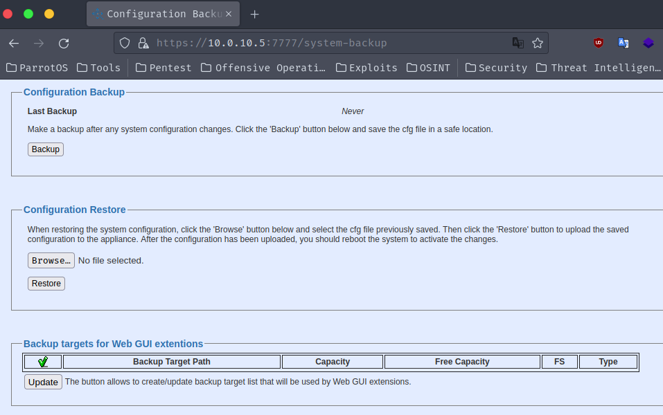

## CVE-2023-51065

### Description
Incorrect access control in QStar Archive Solutions Release RELEASE_3-0 Build 7 Patch 0 allows unauthenticated attackers to obtain system backups and other sensitive information from the QStar Server.

### Vulnerability Type
Incorrect Access Control

### Vendor of Product
QStar

### Affected Product Code Base
QStar Archive Solutions - Release RELEASE_3-0 Build 7 Patch 0

### Exploitation
To exploit this vulnerability, an attacker simply needs to view the component (System-Backup).

### PoC

Simply viewing the system-backup as ANY user on the system will allow you access to download backups.

`/system-backup`

