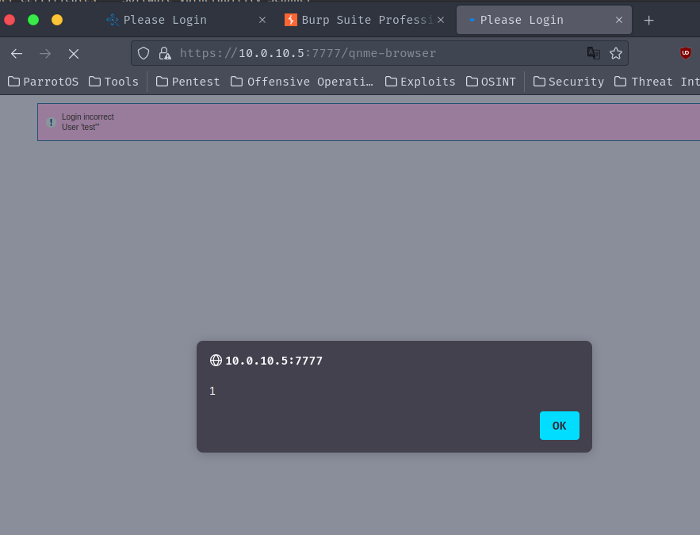

## CVE-2023-51067

### Description
An unauthenticated reflected cross-site scripting (XSS) vulnerability in QStar Archive Solutions Release RELEASE_3-0 Build 7 allows atackers to execute arbitrary javascript on a victim's browser via a crafted link.

### Vulnerability Type
XSS

### Vendor of Product
QStar

### Affected Product Code Base
QStar Archive Solutions - Release RELEASE_3-0 Build 7 Patch 0

### Exploitation
To exploit this vulnerability, a victim must click on a crafted link to reflect javascript on the victims browser.

### PoC

The username in the login task is vulnerable to XSS.

`/task=login&username=test'">&password=test&login=Login`

