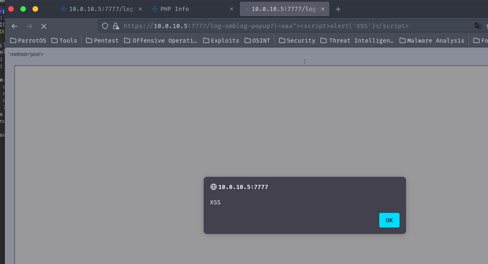
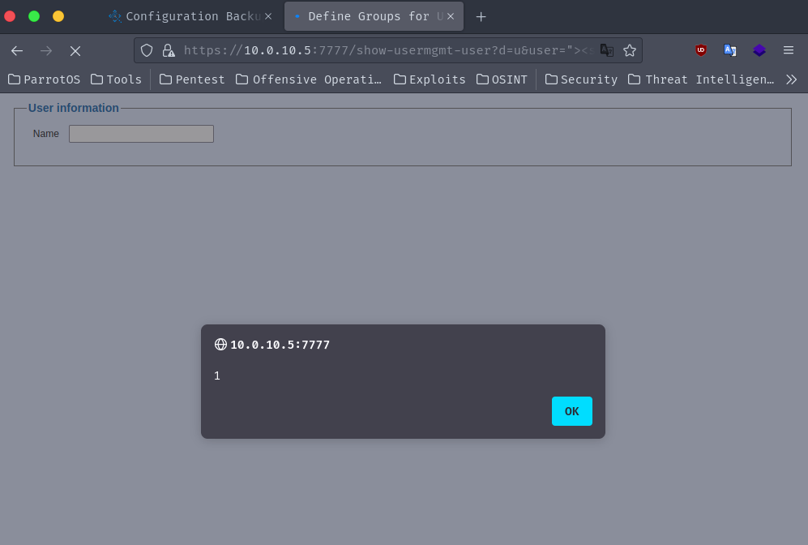

## CVE-2023-51068

### Description
2 authenticated reflected cross-site scripting (XSS) vulnerabilities in QStar Archive Solutions Release RELEASE_3-0 Build 7 allows atackers to execute arbitrary javascript on a victim's browser via a crafted link.

### Vulnerability Type
XSS

### Vendor of Product
QStar

### Affected Product Code Base
QStar Archive Solutions - Release RELEASE_3-0 Build 7 Patch 0

### Exploitation
To exploit this vulnerability, a victim must click on a crafted link to reflect javascript on the victims browser.

### PoC
The first vulnerability lies within `log-smblog-popup`.

`/log-smblog-popup?l=aaa">`

The second vulnerability lies within `show-usermgmt-user`.

`/show-usermgmt-user?d=u&user=">`

