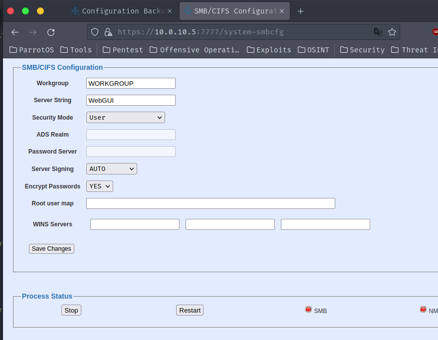

## CVE-2023-51070

### Description
An access control issue in QStar Archive Solutions Release RELEASE_3-0 Build 7 Patch 0 allows unauthenticated attackers to arbitrarily adjust sensitive SMB settings on the QStar Server.

### Vulnerability Type
Incorrect Access Control

### Vendor of Product
QStar

### Affected Product Code Base
QStar Archive Solutions - Release RELEASE_3-0 Build 7 Patch 0

### Exploitation
To exploit this vulnerability, an attacker simply needs to view the page.

### PoC

`/system-smbcfg`

