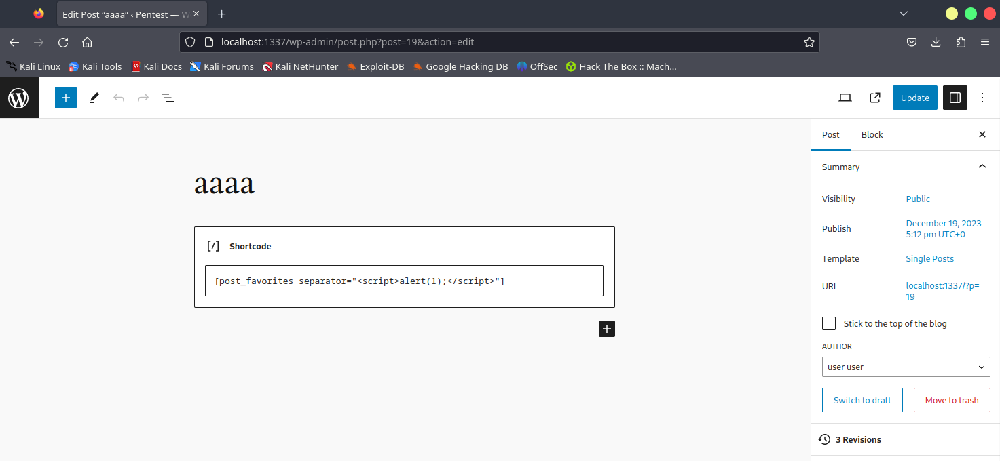
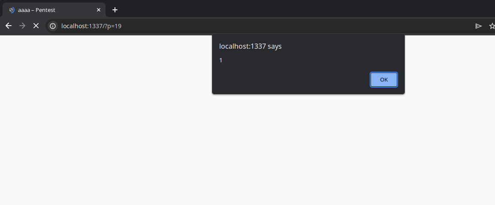

https://cve.mitre.org/cgi-bin/cvename.cgi?name=CVE-2023-2304

## Stored XSS

* Create a post and create a shortcode with the following: `[post_favorites separator=""]`
* Save it, the XSS will now trigger!

